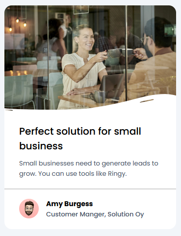

<h1 align="center">Business Blog Card</h1>

  Projeto da Dev Challenges para praticar conhecimentos em HTML e CSS.

  

 

## 🚀 Tecnologias

Esse projeto foi desenvolvido com as seguintes tecnologias:

- HTML e CSS
- Git Github

## 💻 Projeto

Business Blog Card é um cartão de visita.

  

  
<a href="https://dev-challenges-business-blog-card-starter-master.vercel.app/" target="_blank">Clique para</a> acessar o link</a>
  

## Conclusão

Consegui centralizar o projeto usando grid. Praticando sempre para aprimorar conhecimentos em Front-End. 😉

